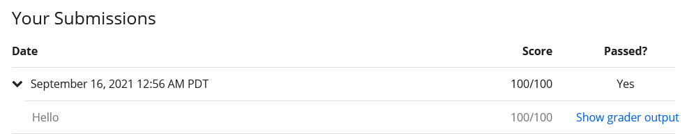

# 1. 环境配置

本人平台是 `Windows 10`

官方的那个一个G大小的`lift-java-installer.exe`是真的不错，完全傻瓜式操作`下载->安装-使用`，让我真心佩服这些大佬，为了让小白快速上手不知做了多少工作。

[Windows平台环境配置官方文档（纯英文）](https://lift.cs.princeton.edu/java/windows/)

# 2. 作业题

第二题`HelloGoodby.java`只能处理输入两个人名（但足以满足题意），理论上能用一个循环（?）满足多个名字的识别。

第三题`RandomWord.java`在终端输入词时，使用`Ctrl+Z`结束输入（Win平台）

